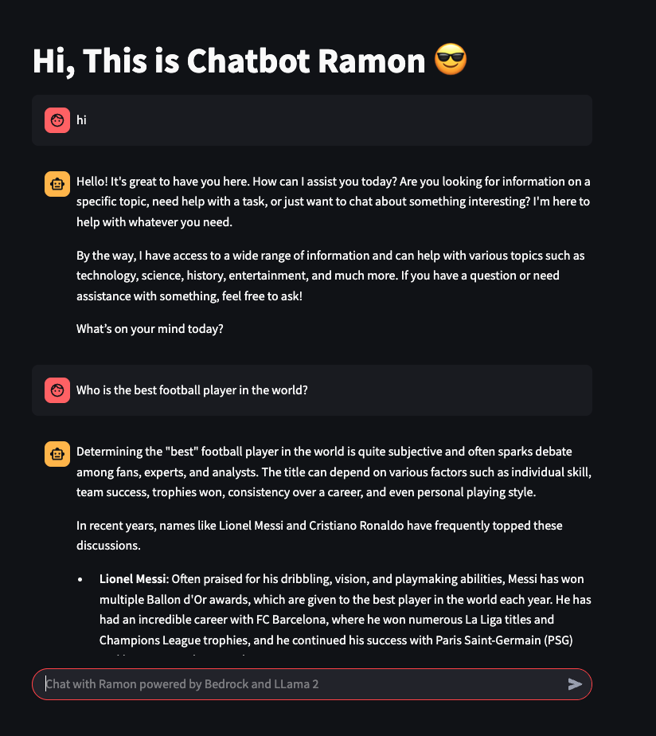
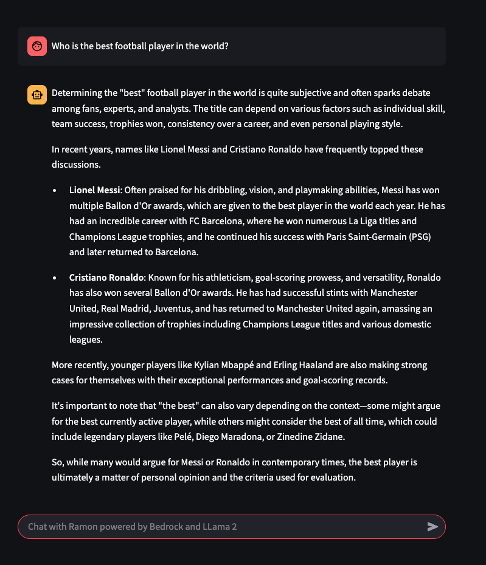

# 🤖 Chatbot Ramon - Powered by Amazon Bedrock & Streamlit

An intelligent chatbot named **Ramon**, built using [LangChain](https://www.langchain.com/), [Streamlit](https://streamlit.io/), and [Amazon Bedrock](https://aws.amazon.com/bedrock/), enabling natural language interactions with conversational memory.


---

## 🛠 Technologies Used

- **Python 3.10+**
- **Streamlit** — Interactive frontend
- **LangChain** — Conversational chain and memory management
- **Amazon Bedrock** — LLM model Titan (nova-pro-v1)
- **AWS SDK with configured profile**

---

## ⚙️ How to Run locally

1. **Clone this repository:**
   ```bash
   git clone https://github.com/seu-usuario/seu-repo.git
   cd seu-repo

2. **Create and activate a virtual environment:**
    ```bash
    python -m venv venv
    source venv/bin/activate  # Linux/macOS
    venv\Scripts\activate     # Windows

3. **Install dependencies:**:
    ```bash
    pip install -r requirements.txt

4. **Configure your AWS profile:**:
    ```bash
    aws configure --profile default

5. **Run the chatbot:**:
    ```bash
    streamlit run chatbot_frontend.py

6. **Project structure:**:
    ```bash
    .
    ├── app.py                   # Main Streamlit application
    ├── chatbot_backend.py       # Backend logic with LangChain
    ├── images/                  # (Optional) Project-related images
    ├── requirements.txt
    └── README.md

## 📷 UI Example




